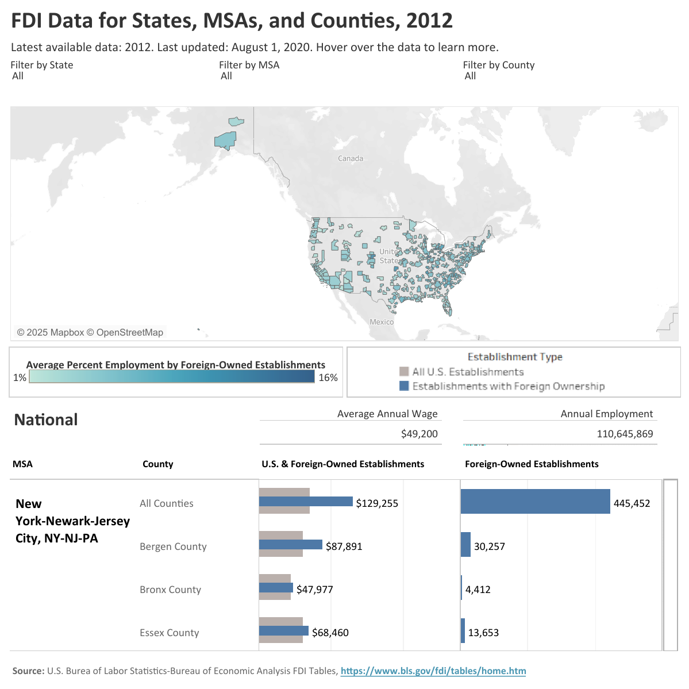
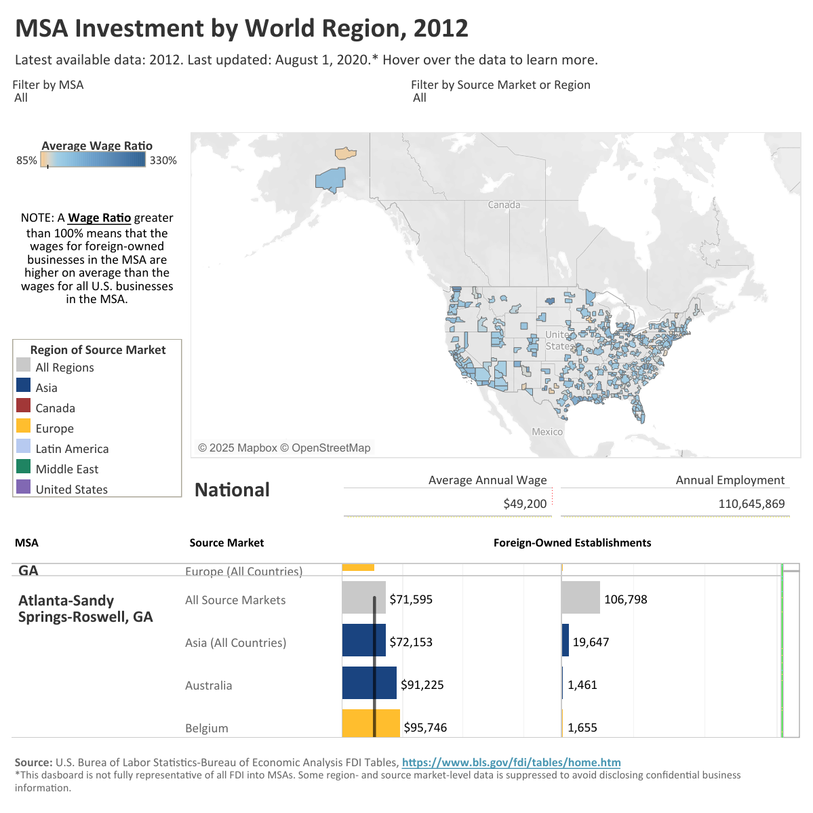

Visualizations
================

## Public Visualizations

### Work for SelectUSA:

I created public interactive data visualizations on foreign direct
investment (FDI) into the United States at the metropolitan statistical
area (MSA) level from Bureau of Labor Statistics (BLS) data.

(FDI Data for States, MSAs, and
Counties)\[<https://www.trade.gov/data-visualization/fdi-data-states-msas-and-counties>\]
*August 2020* 

(MSA Investment by World
Region)\[<https://www.trade.gov/data-visualization/msa-investment-world-region>
\] *August 2020* 

### Personal:

(Tour de France
2024)\[<https://public.tableau.com/app/profile/sarah.cole2864/viz/TourdeFrance2024/TourdeFrance>\]
*June 2024* 

## Look upon my works, ye Mighty, and despair!

### For the USAID ones are no longer funded.

The following downloaded images are from public Tableau dashboards I
created/managed during my time at USAID Data Services. They were
publically available until February 2025.

**Evaluation Registry Dashboard:** *January 2025* I managed the FY2023
update of the Evaluation Registry Dashboard, which provided an easy way
to access and analyze USAID evaluations by country, sector, year, and
type of evaluation (impact or performance).

Map View 

Country View, including a view of the Evaluation Abstract highlighted
when hovering over each evaluation. I managed the FY23 manual creation
of these abstracts.  

Sector View 

**Digital Ecosystem Country Assessment (DECA) Dashboard:** *January
2023* I created the Monitoring, Evaluation, and Learning tab, which
monitored selected indicators of digital growth across countries with
available data. I created a graph comparing the indicators between base
years and available years selected by the user. Countries receiving
USAID assistance are marked, and countries by region are highlighted by
color.

Active Mobile Money Agent Outlets (Per 100,000 Adults), Base Year 2017:
 E-Government Development Index Score (0-1), Base
Year 2018: 

Freedom on the Net: Overall Score (0-100), Base Year 2019: 

Global Competitiveness Index: Competition in Network Services, Value
(1-7), Base Year: 2018 

ICT Regulatory Tracker: Competitiveness Framework Score (0-28), Base
Year: 2019 

ICT Regulatory Tracker: Overall Score (0-100), Base Year: 2019 
